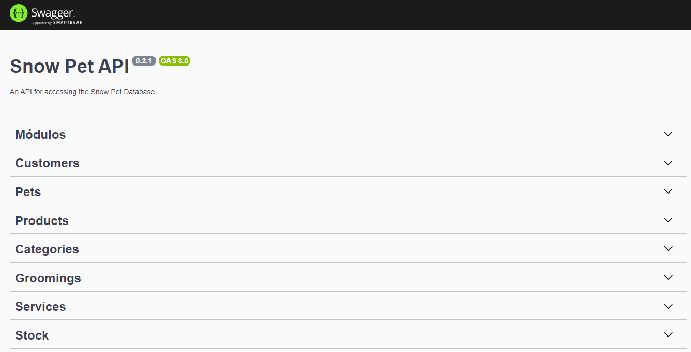

# Snow Pet API

A **Snow Pet API** é uma API desenvolvida em NestJS para gerenciar as operações de um pet shop, incluindo serviços de banho e tosa e a venda de produtos para pets. A API utiliza Prisma como ORM e o banco de dados MongoDB hospedado no MongoDB Atlas.



## Tecnologias Utilizadas

- **NestJS**: Framework para construir aplicações server-side eficientes e escaláveis.
- **Prisma**: ORM para conectar ao banco de dados MongoDB.
- **MongoDB Atlas**: Serviço de banco de dados em cloud.
- **TypeScript**: Linguagem de programação utilizada no desenvolvimento do projeto.

## Funcionalidades

- Gerenciamento de pets.
- Gerenciamento de clientes.
- Controle de estoque de produtos.
- Registro de vendas de produtos e serviços de banho e tosa.
- Métricas e relatórios.

## Front-End

- [Snow Pet Shop](https://github.com/viniciussis/Snow_Pet)

## Documentação da API

A documentação completa da API está disponível na rota: [http://localhost:3000/api](http://localhost:3000/api)

## Pré-requisitos

Antes de rodar o projeto, certifique-se de ter as seguintes ferramentas instaladas em sua máquina:

- [Node.js](https://nodejs.org/en/download/)
- npm (geralmente vem com o Node.js) ou [Yarn](https://classic.yarnpkg.com/en/docs/install/)
- [Nest CLI](https://docs.nestjs.com/cli/overview)
  ```bash
  npm install -g @nestjs/cli
  ```

## Instalação

1. **Clone o repositório:**

   ```bash
   git clone https://github.com/viniciussis/Snow_Pet_API.git
   cd Snow_Pet_API
   ```

2. **Instale as dependências:**

   ```bash
   npm install
   # ou
   yarn install
   ```

3. **Configure as variáveis de ambiente:**
   Crie um arquivo `.env` na raiz do projeto e adicione as seguintes variáveis de ambiente:

   ```env
   DATABASE_URL="mongodb+srv://<usuário>:<senha>@cluster0.mongodb.net/<nome-do-banco>?retryWrites=true&w=majority"
   ```

4. **Rode as migrações do Prisma:**

   ```bash
   npx prisma migrate dev
   ```

5. **Popule o banco de dados com dados iniciais (seed):**

   ```bash
   npx prisma db seed
   ```

6. **Inicie o servidor de desenvolvimento:**
   ```bash
   npm run start:dev
   # ou
   yarn start:dev
   ```

## Uso

Após iniciar o servidor, você pode acessar a documentação da API em [http://localhost:3000/api](http://localhost:3000/api) para explorar os endpoints disponíveis e testar as funcionalidades.

## Contribuição

Se você deseja contribuir com o projeto, siga os passos abaixo:

1. **Fork o repositório**
2. **Crie uma branch para a sua feature:** (`git checkout -b minha-feature`)
3. **Commit suas mudanças:** (`git commit -m 'Adicionei minha feature'`)
4. **Push para a branch:** (`git push origin minha-feature`)
5. **Abra um Pull Request**

## Licença

Este projeto está licenciado sob a [MIT License](LICENSE).
